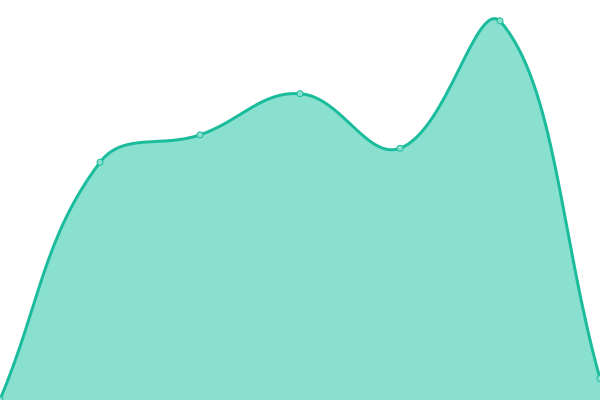
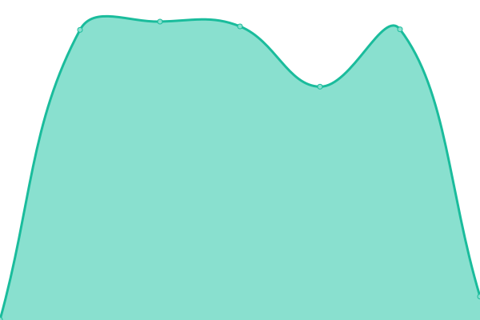
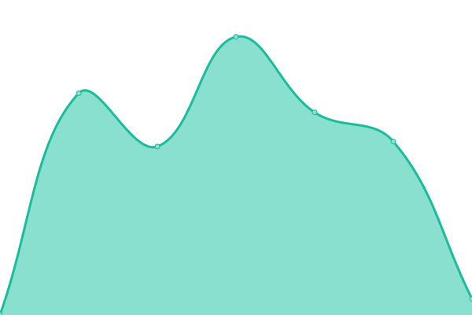

# [📈 Live Status](https://demo.upptime.js.org): <!--live status--> **🟧 Partial outage**

This repository contains the open-source uptime monitor and status page for [DD360](https://dd360.mx), powered by [Upptime](https://github.com/upptime/upptime).

With [Upptime](https://upptime.js.org), you can get your own unlimited and free uptime monitor and status page, powered entirely by a GitHub repository. We use [Issues](https://github.com/dd3tech/status_page/issues) as incident reports, [Actions](https://github.com/dd3tech/status_page/actions) as uptime monitors, and [Pages](https://demo.upptime.js.org) for the status page.

<!--start: status pages-->
<!-- This summary is generated by Upptime (https://github.com/upptime/upptime) -->
<!-- Do not edit this manually, your changes will be overwritten -->
<!-- prettier-ignore -->
| URL | Status | History | Response Time | Uptime |
| --- | ------ | ------- | ------------- | ------ |
|  [DD360 Landing page](https://dd360.mx) | 🟩 Up | [dd-360-landing-page.yml](https://github.com/dd3tech/status-page/commits/HEAD/history/dd-360-landing-page.yml) | 

 129ms
     
 | 

<a href="https://status.dd360.mx/history/dd-360-landing-page">100.00%</a>
    

|  [Buildd3r Landing page](https://dd360.mx) | 🟩 Up | [buildd3r-landing-page.yml](https://github.com/dd3tech/status-page/commits/HEAD/history/buildd3r-landing-page.yml) | 

 19ms
     
 | 

<a href="https://status.dd360.mx/history/buildd3r-landing-page">100.00%</a>
    

|  [BUI Documentation](https://bui.dd360.mx) | 🟩 Up | [bui-documentation.yml](https://github.com/dd3tech/status-page/commits/HEAD/history/bui-documentation.yml) | 

 161ms
     
 | 

<a href="https://status.dd360.mx/history/bui-documentation">100.00%</a>
    

|  [DD360 WEB APP (Core)](https://app.dd360.mx) | 🟩 Up | [dd-360-web-app-core.yml](https://github.com/dd3tech/status-page/commits/HEAD/history/dd-360-web-app-core.yml) | 

 115ms
     
 | 

<a href="https://status.dd360.mx/history/dd-360-web-app-core">100.00%</a>
    

|  [Onboarding WEB APP](https://onboarding.dd360.mx) | 🟩 Up | [onboarding-web-app.yml](https://github.com/dd3tech/status-page/commits/HEAD/history/onboarding-web-app.yml) | 

 268ms
     
 | 

<a href="https://status.dd360.mx/history/onboarding-web-app">100.00%</a>
    

|  API's - Business | 🟩 Up | [api-s-business.yml](https://github.com/dd3tech/status-page/commits/HEAD/history/api-s-business.yml) | 

 2752ms
     
 | 

<a href="https://status.dd360.mx/history/api-s-business">100.00%</a>
    

|  API's - Loans | 🟩 Up | [api-s-loans.yml](https://github.com/dd3tech/status-page/commits/HEAD/history/api-s-loans.yml) | 

 1660ms
     
 | 

<a href="https://status.dd360.mx/history/api-s-loans">100.00%</a>
    

|  API's - Projects | 🟩 Up | [api-s-projects.yml](https://github.com/dd3tech/status-page/commits/HEAD/history/api-s-projects.yml) | 

 1580ms
     
 | 

<a href="https://status.dd360.mx/history/api-s-projects">100.00%</a>
    

|  API's - Onboarding | 🟩 Up | [api-s-onboarding.yml](https://github.com/dd3tech/status-page/commits/HEAD/history/api-s-onboarding.yml) | 

 1479ms
     
 | 

<a href="https://status.dd360.mx/history/api-s-onboarding">100.00%</a>
    

|  API's - Accounts | 🟩 Up | [api-s-accounts.yml](https://github.com/dd3tech/status-page/commits/HEAD/history/api-s-accounts.yml) | 

 718ms
     
 | 

<a href="https://status.dd360.mx/history/api-s-accounts">100.00%</a>
    

|  API's - Documents | 🟩 Up | [api-s-documents.yml](https://github.com/dd3tech/status-page/commits/HEAD/history/api-s-documents.yml) | 

 1547ms
     
 | 

<a href="https://status.dd360.mx/history/api-s-documents">100.00%</a>
    

|  API's - Financial model | 🟩 Up | [api-s-financial-model.yml](https://github.com/dd3tech/status-page/commits/HEAD/history/api-s-financial-model.yml) | 

 1594ms
     
 | 

<a href="https://status.dd360.mx/history/api-s-financial-model">100.00%</a>
    

|  API's - Sales expenses | 🟩 Up | [api-s-sales-expenses.yml](https://github.com/dd3tech/status-page/commits/HEAD/history/api-s-sales-expenses.yml) | 

 1515ms
     
 | 

<a href="https://status.dd360.mx/history/api-s-sales-expenses">100.00%</a>
    

|  API's - Async | 🟥 Down | [api-s-async.yml](https://github.com/dd3tech/status-page/commits/HEAD/history/api-s-async.yml) | 

 30ms
     
 | 

<a href="https://status.dd360.mx/history/api-s-async">0.00%</a>
    

|  API's - Developers | 🟩 Up | [api-s-developers.yml](https://github.com/dd3tech/status-page/commits/HEAD/history/api-s-developers.yml) | 

 1551ms
     
 | 

<a href="https://status.dd360.mx/history/api-s-developers">100.00%</a>
    

|  API's - Integrations | 🟩 Up | [api-s-integrations.yml](https://github.com/dd3tech/status-page/commits/HEAD/history/api-s-integrations.yml) | 

 1534ms
     
 | 

<a href="https://status.dd360.mx/history/api-s-integrations">100.00%</a>
    

|  API's - Users | 🟩 Up | [api-s-users.yml](https://github.com/dd3tech/status-page/commits/HEAD/history/api-s-users.yml) | 

 1568ms
     
 | 

<a href="https://status.dd360.mx/history/api-s-users">100.00%</a>
    

|  API's - Seduvi | 🟩 Up | [api-s-seduvi.yml](https://github.com/dd3tech/status-page/commits/HEAD/history/api-s-seduvi.yml) | 

 527ms
     
 | 

<a href="https://status.dd360.mx/history/api-s-seduvi">100.00%</a>
    

<!--end: status pages-->

[**Visit our status website →**](https://demo.upptime.js.org)

## 📄 License

- Powered by: [Upptime](https://github.com/upptime/upptime)
- Code: [MIT](./LICENSE) © [DD360](https://dd360.mx)
- Data in the `./history` directory: [Open Database License](https://opendatacommons.org/licenses/odbl/1-0/)
